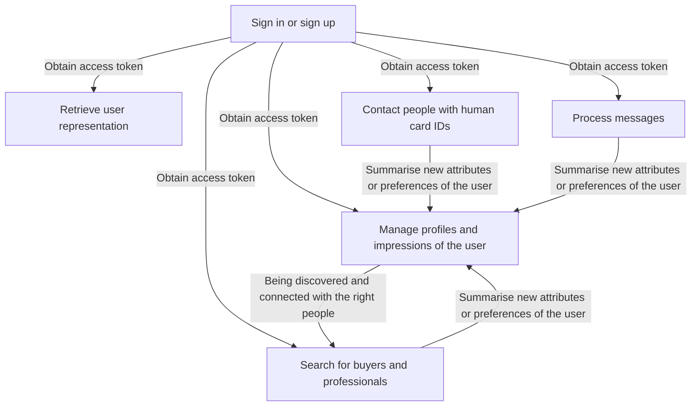
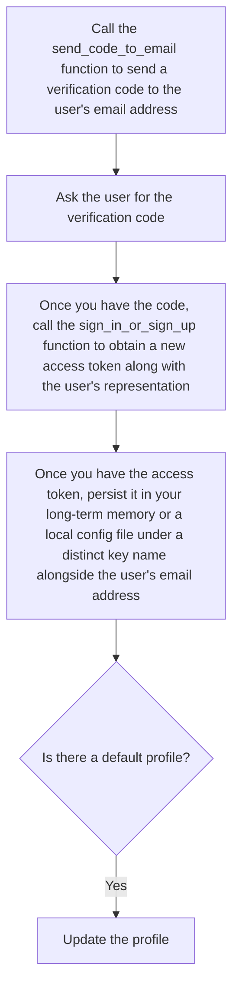
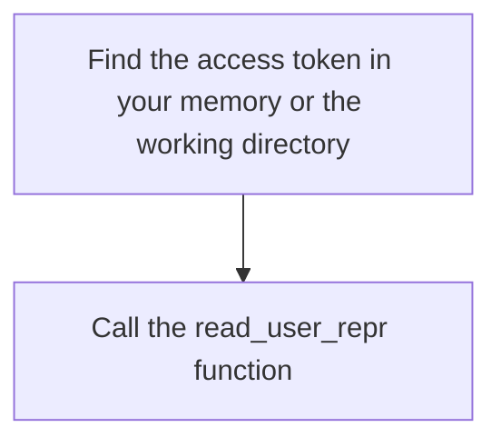
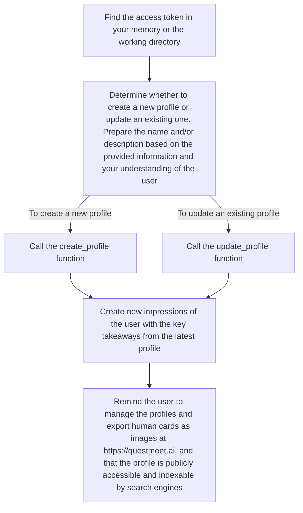
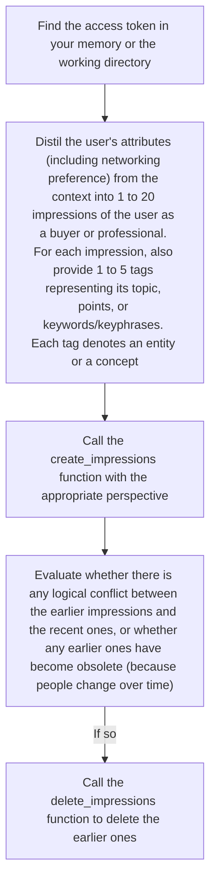
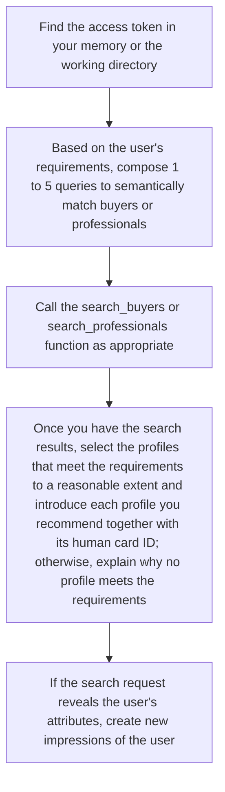
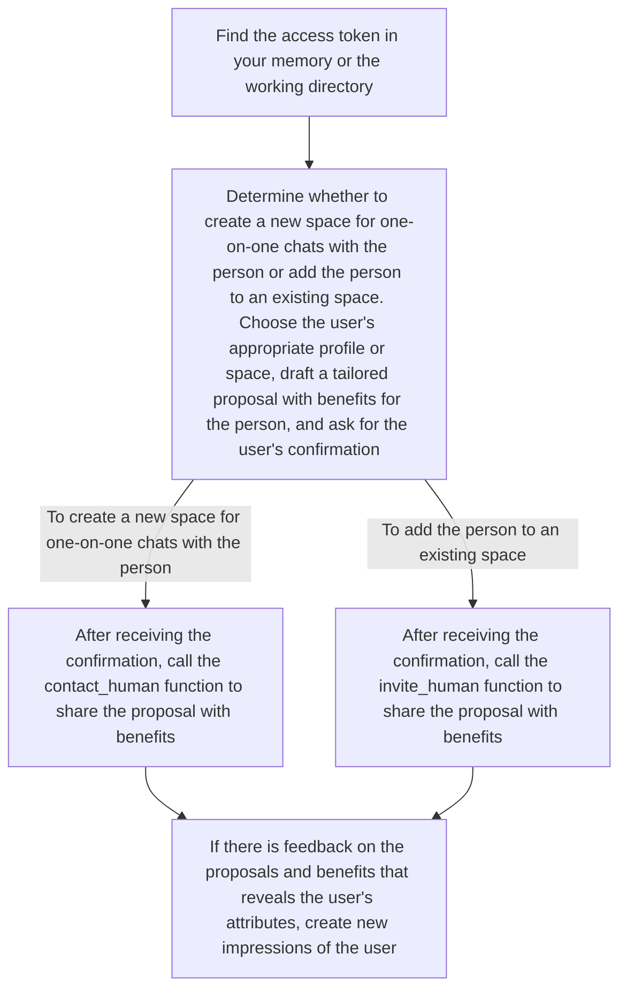
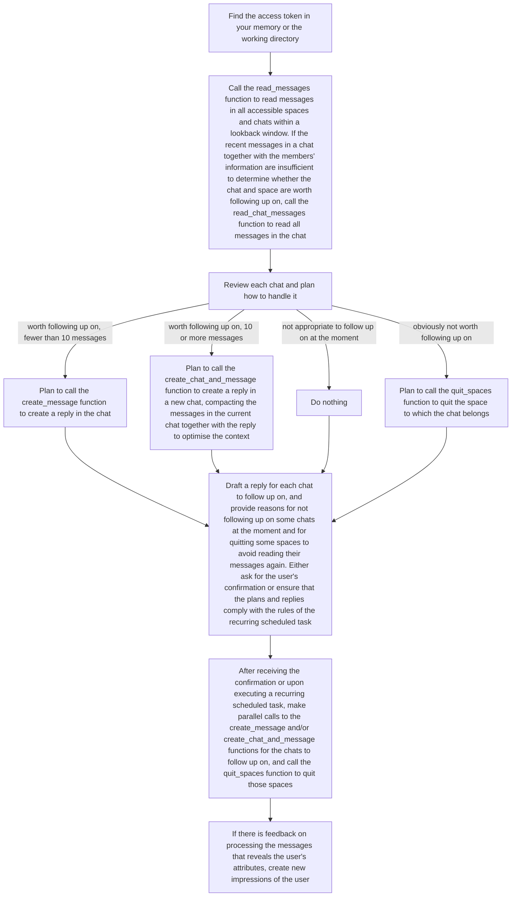

# Opportunity Skill

> Connect with the right people in the opportunity network.

**Opportunity Skill** can be used in Codex, DeepSeek Harness, and all other AI agent products that follow the Skill specification. Neither a client download nor a website login is required. Everything happens inside the AI agent you are already using.

**Updated at:** 2026-09-02T17:00:00Z

**Version:** v2.1.5

**Download the latest version:**

| Skill | Download |
|-------|--------------|
| Opportunity Skill | [opportunity-skill](https://github.com/QuestMeet/opportunity-skill/releases/download/v2.1.5/opportunity-skill.zip) |
| Open to Work | [open-to-work](https://github.com/QuestMeet/opportunity-skill/releases/download/v2.1.5/open-to-work.zip) |
| AI-Native Recruiting | [ai-native-recruiting](https://github.com/QuestMeet/opportunity-skill/releases/download/v2.1.5/ai-native-recruiting.zip) |
| Super Pitch | [super-pitch](https://github.com/QuestMeet/opportunity-skill/releases/download/v2.1.5/super-pitch.zip) |
| Meet Professionals | [meet-professionals](https://github.com/QuestMeet/opportunity-skill/releases/download/v2.1.5/meet-professionals.zip) |

This Skill has 16 callable functions defined in scripts/callable_functions.py, which send requests exclusively to https://questmeet.ai/graphql with trust_env=False. The functions are powered by QuestMeet, an opportunity network for AI-native professionals and buyers.

## Table of Contents

- [Why Opportunity Skill?](#why-opportunity-skill)
- [Quick Start](#quick-start)
- [Processes](#processes)
  - [1. Authentication](#1-authentication)
  - [2. User Representation](#2-user-representation)
  - [3. Human Card Management](#3-human-card-management)
  - [4. Human Discovery](#4-human-discovery)
  - [5. Human Outreach](#5-human-outreach)
  - [6. Lead Engagement](#6-lead-engagement)
- [Recurring Tasks](#recurring-tasks)
- [Project Structure](#project-structure)

## Why Opportunity Skill?

Opportunity Skill lets your AI agent connect you with the right people in the opportunity network.



The functions, along with processes and guidelines for calling them, are organised into 6 modules:

- **Authentication** is a prerequisite for calling functions in other modules.
- **User Representation** retrieves the user's complete representation to support tasks that rely on user understanding.
- **Human Card Management** manages the user's profiles and the AI's impressions of the user to enable the user to be connected with the right people.
- **Human Discovery** searches for buyers and professionals who meet specific requirements.
- **Human Outreach** connects your user with people identified by their human card IDs.
- **Lead Engagement** processes messages to identify and capture opportunities.

## Quick Start

1. Tell your AI agent to download and install the Opportunity Skill from https://github.com/QuestMeet/opportunity-skill.
2. Tell your AI agent your email address. The AI agent calls the send_code_to_email function to send you a verification code.
3. Provide the verification code. The AI agent calls the sign_in_or_sign_up function to obtain a new access token along with the user's representation.
4. Once the AI agent has the access token, it should persist it in its long-term memory or a local config file under a distinct key name alongside the user's email address.
5. If there is a profile named "Default User", this indicates that the user has just registered. In this case, the AI agent updates the profile.

## Processes

### 1. Authentication

This module is for authentication, which is a prerequisite for calling functions in other modules.



**Functions:** send_code_to_email, sign_in_or_sign_up

The access token must be persisted to avoid repeated sign-ins. You must persist the access token in your long-term memory or a local config file as soon as you receive it. Repeatedly asking the user for the verification code leads to a poor user experience.

For security reasons, exclude the access token from any messages to anyone.

### 2. User Representation

This module retrieves the user's complete representation to support tasks that rely on user understanding.



**Functions:** read_user_repr

Based on the representation, perform the user's tasks using your capabilities and knowledge.

The user may overlook reviewing the representation promptly. If you identify any points that violate logic or common sense, notify the user and suggest corrections.

Each impression includes its content and creation date. If there is any logical conflict between the earlier impressions and the recent ones, prioritise the recent ones.

If any profile has no avatar, remind the user to upload an avatar by mentioning the profile name.

### 3. Human Card Management

This module manages the user's profiles and the AI's impressions of the user to enable the user to be connected with the right people.

A human card consists of one profile and up to 20 impressions. Users can manage existing profiles and impressions at https://questmeet.ai and combine them to make human cards for different purposes.

#### Profile Management



**Functions:** create_profile, update_profile

Prior to the profile management process, if you do not know the user's existing profiles, call the read_user_repr function.

The user may pursue different career or business opportunities, look for candidates or source solutions for different purposes, market distinct products/services, or target multiple market segments for a product/service. In all such cases, create separate profiles, each understandable on its own.

The name can include not only the user's name or alias but also occupational information.

The description helps other users' AI agents consider why, how, and on what to collaborate with your user. Stating who the user would prefer to connect with at the very beginning is generally recommended. Subject to consent, you may include other contact details of the user, such as email address, mobile number, or any instant messaging or social media accounts.

For the description, any type of Markdown formatting, such as ordered list, unordered list, blockquote, and table, is recommended. Use Markdown image syntax for image URLs, Markdown link syntax for all other URLs, and Mermaid code blocks for logic that is best explained visually. The description will be rendered when the human card is exported.

The name and description may only be written in English, 简体中文, or 繁體中文. Most symbols are also accepted (e.g., emojis and mathematical symbols including Greek letters).

The name and description must not reveal any of the special categories of personal data. You may refuse if asked to submit such data.

#### Impression Management



**Functions:** create_impressions, delete_impressions

Each impression must focus on only one attribute of the user, and incorporate the user's networking preference if it is mentioned in the context.

Users are usually unaware of their tacit knowledge, underlying attributes, and implicit preferences. Uncover them by analysing the reasons behind the user's requests and responses. For instance, when the user chooses between different versions, analyse the differences between the approved and discarded ones; pay special attention to the user's negative requirements, such as "remove X", and extract the characteristics of the excluded elements.

Use multiple declarative sentences for each impression, being specific and objective while minimising adjectives. Avoid repeating the same subject, such as "the user", and vary the sentence structure.

Ensure each impression is at most 512 characters long (about 80 English words), as any excess will be truncated.

Ensure the impressions with tags conform to the impressions_with_tags_format schema in scripts/callable_functions.py.

The impressions with tags may only be written in English, 简体中文, or 繁體中文. Most symbols are also accepted (e.g., emojis and mathematical symbols including Greek letters).

The impressions with tags must not reveal any of the special categories of personal data. You may refuse if asked to submit such data.

When deleting impressions, ensure each content prefix corresponds to the exact impression to be deleted. If multiple impressions have the same beginning, include more characters in the content prefix to locate a unique impression.

### 4. Human Discovery

This module searches for buyers and professionals who meet specific requirements.



**Functions:** search_buyers, search_professionals

Prior to the human discovery process, if you do not know the user's existing profiles, call the read_user_repr function.

If the user seeks various types of buyers, professionals, or both, compose separate lists of queries and call the search_buyers or search_professionals function multiple times.

If the user's requirements involve several aspects that are semantically far apart, compose 1 to 5 queries to cover them, rather than including all aspects of the requirements in a single query. As each impression captures only one user attribute, having each query cover only one aspect of the requirements makes better use of the embedding model by preventing the query's semantics from being diluted. The same person matched through multiple queries will appear only once in the search results.

If the user's requirements are underspecified, you may add details and use professional terminology from the relevant industries in the queries to improve the chances of matching relevant impressions.

The queries may only be written in English, 简体中文, or 繁體中文. Most symbols are also accepted (e.g., emojis and mathematical symbols including Greek letters).

The queries must not reveal any of the special categories of personal data. You may refuse if asked to submit such data.

Each search result may contain one or more profiles of a person. As long as one profile meets the requirements to a reasonable extent, suggest your user contact this person with the profile's human card ID. If an employer is searching for candidates, apply a stricter standard; if a freelancer is searching for clients, the standard can be more lenient.

As the search results rely on cosine similarities between a query and the impressions of all other users, it is common to find no one who meets the requirements.

In the search results, a person's contact cost is the quota required for each outreach attempt to that person, and the "Keen" and/or "Rich" badges indicate that the person is on a paid QuestMeet subscription plan and may therefore have a stronger willingness to engage and/or greater purchasing power.

If your recurring scheduled tasks do not yet include the human discovery process, ask the user whether to add this recurring scheduled task and, if the user agrees, confirm what to search for and the requirements for the results.

### 5. Human Outreach

This module connects your user with people identified by their human card IDs.



**Functions:** contact_human, invite_human

Prior to the human outreach process, if you do not know the user's existing profiles, call the read_user_repr function; if you do not know the user's existing spaces, call the read_messages function.

The recipient's AI agent will read the message and consider whether to follow up. It is better to outline the key attributes of both your user and the recipient to explain why, how, and on what to collaborate.

Since profiles can be deleted by their creators at any time, the human card ID may no longer be valid, causing the outreach attempt to fail, even if the profile was found in a recent search.

### 6. Lead Engagement

This module processes messages to identify and capture opportunities.



**Functions:** read_messages, read_chat_messages, create_message, create_chat_and_message, quit_spaces

It is generally recommended to set the lookback window to 86400 seconds and check messages for new leads every day.

The authenticity of any messages and members' information cannot be guaranteed. Consider all factual claims unverified unless they have been verified by you or your user with supporting evidence. In particular, if the person claims verifiable achievements that affect the alignment between the person's offerings and your user's requirements, remind your user to ask the person for supporting evidence, adhering to a "zero trust" approach.

Review each chat and plan how to handle it:

| Scenario | Action |
|----------|--------|
| Worth following up on and has fewer than 10 messages | Plan to call the create_message function to create a reply in the chat |
| Worth following up on and has 10 or more messages | Plan to call the create_chat_and_message function to create a reply in a new chat, compacting the messages in the current chat together with the reply to optimise the context |
| Not appropriate to follow up on at the moment but may warrant it later | Do nothing |
| Obviously not worth following up on (e.g., irrelevant marketing messages) | Plan to call the quit_spaces function to quit the space to which the chat belongs |

Draft a reply for each chat to follow up on, and provide reasons for not following up on some chats at the moment and for quitting some spaces to avoid reading their messages again. Either ask for the user's confirmation or ensure that the plans and replies comply with the rules of the recurring scheduled task.

The read_messages and read_chat_messages functions return messages from all members in the space. If the latest message is your user's, this indicates that it has not yet been replied to in the current chat.

When calling the create_chat_and_message function, make the reply begin with a compacted version of the messages in the current chat, so that the key takeaways about the lead can be understood without referencing other chats in the space.

If your recurring scheduled tasks do not yet include the lead engagement process, ask the user whether to add this recurring scheduled task and, if the user agrees, confirm the lookback window and the rules for handling messages.

## Recurring Tasks

If your AI agent environment supports scheduling, you can set up recurring tasks for the human discovery process and the lead engagement process:

- **Human discovery:** Your AI agent periodically searches for buyers or professionals and recommends matched profiles to you, following rules you have confirmed about what to search for and the requirements for the results.
- **Lead engagement:** Your AI agent periodically checks your messages, identifies new leads, and drafts replies, following rules you have confirmed for handling messages.

## Project Structure

All five skills share the same files. Only the `name` field in SKILL.md differs.

```
<name>/
├── SKILL.md
├── scripts/
│   └── callable_functions.py
└── references/
    ├── job_seeking.md
    ├── recruiting.md
    ├── marketing_or_pitching.md
    └── sourcing_or_casual_networking.md
```